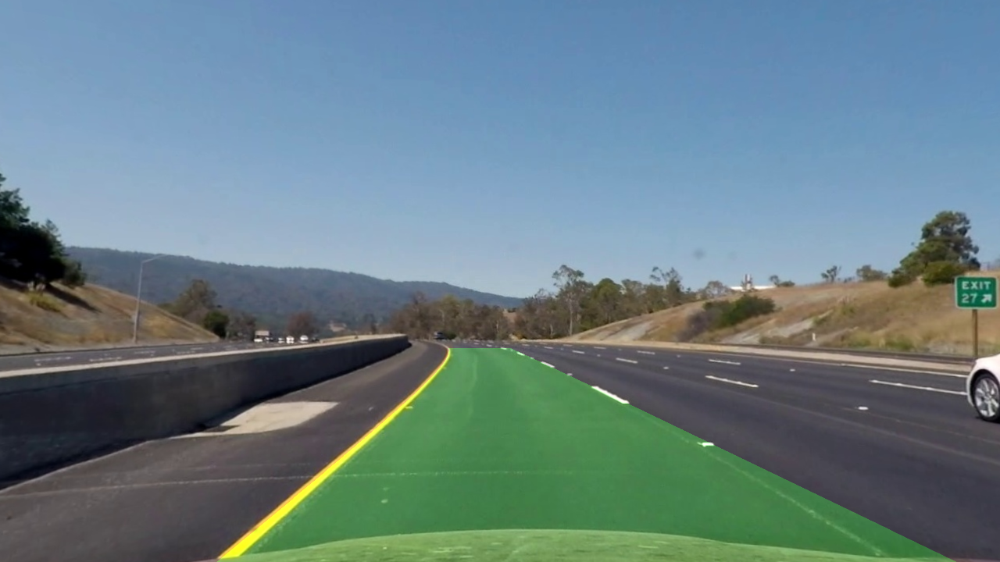
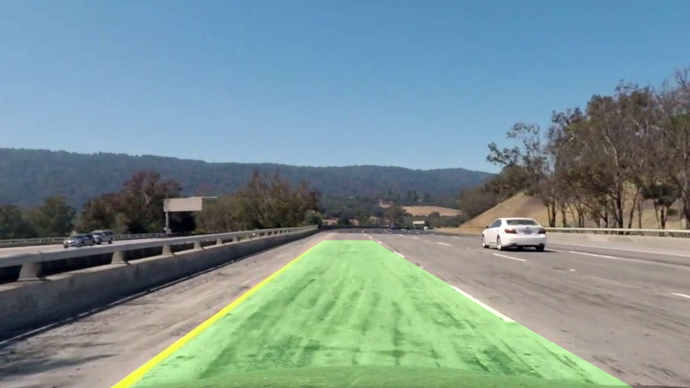

# AdvancedLaneDetector
Detecting curved lane and computing radius of curvature   


- ## Project Goal   
    > Applying what I have learned in classical computer vision to build something useful   
    > that let me breakthrough self driving technology.   
 
- ## Project Objectives:
    - [x] Calibrating and undistorting the camera model used to shoot the project dataset
    - [x] Extracting lanes binary mask using color/edge thresholding 
    - [x] Selecting ROI region points of the lane to be tracked
    - [x] Transforming polygon ROI points to rectangular bird view points
    - [x] Applying histogram peaks to estimate initial left/right lane centers
    - [x] Using sliding window to locate/group pixels belong to same lane
    - [x] Fitting polynomial equation that represent the curved lanes
    - [x] Mapping the fitted equation from bird view to roi view
    - [x] Plot polygon filling the region between the left/right lanes
    - [x] Run in realtime for videos: Analyze more than 15 **`FPS`**


- ## Project Setup and Requirements   
    **`use python3.5`** or newer versions to install and run the package  
    ```bash
    $ git clone https://github.com/loaywael/AdvancedLaneDetector.git   
    $ pip3 install -r requirements.txt      
    ```   
    
    alternatively install dependencies in virtualenv `recommended`   
    ```bash
    $ pip3 install virtualenv   
    $ python3 -m virtualenv venv   
    $ pip3 install -r requirements.txt   
    ```   


- ## How to Use   
    `HogModel` is excutable package can be run given command arguments   

    supported arguments:   
    - **`path`**: the image/video to be analyzed   
    </br>   

    ```bash  
    $ cd ./src     
    $ python -m LaneDetector ../data/driving_datasets/project_video.mp4   
    ```

    </br></br></br>   
    <h3 align=center>Project Demo</h3>
    
    <table><tr>
    <td></td>
    <td></td>
    </tr></table>
    </br></br>
   
***

# REFERENCES

> Thanks for these references I was able to get over problems I've faced during implementation.   
>   
>    PyData Webinar by Ross Kippenbrock   
    https://www.youtube.com/watch?v=VyLihutdsPk   
    Udacity open dataset    
    https://github.com/udacity/CarND-Advanced-Lane-Lines


