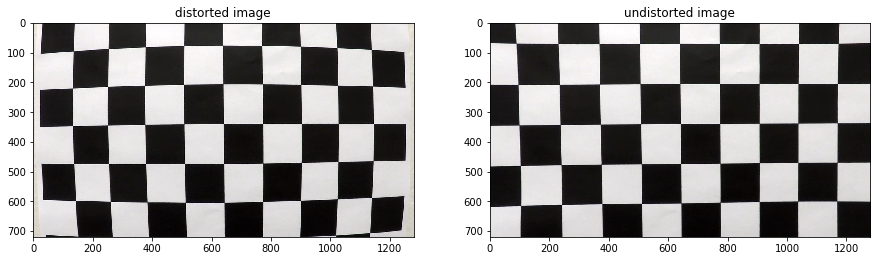
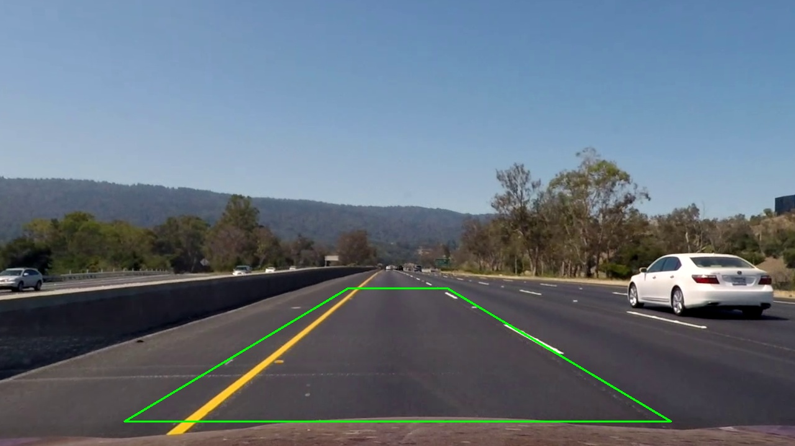
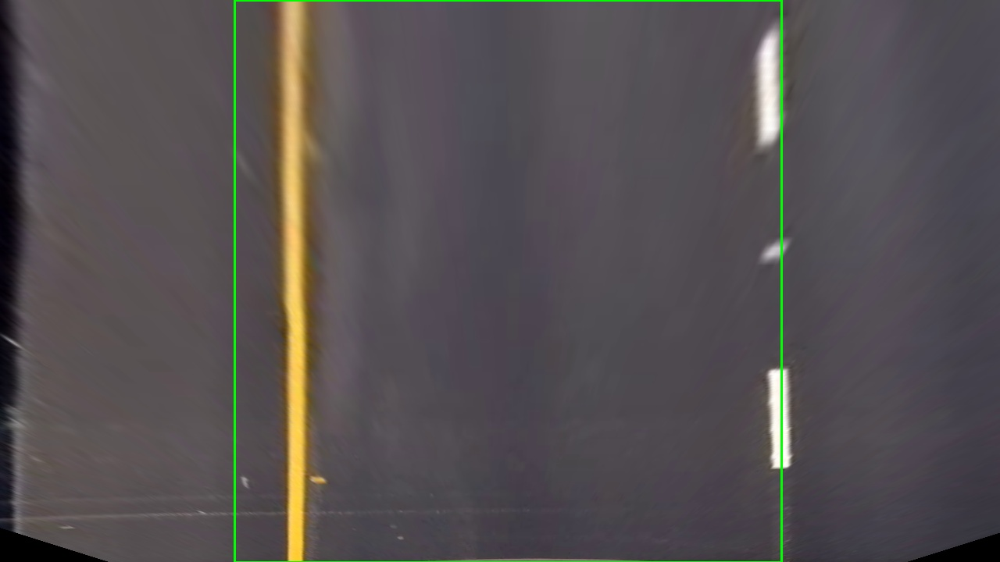
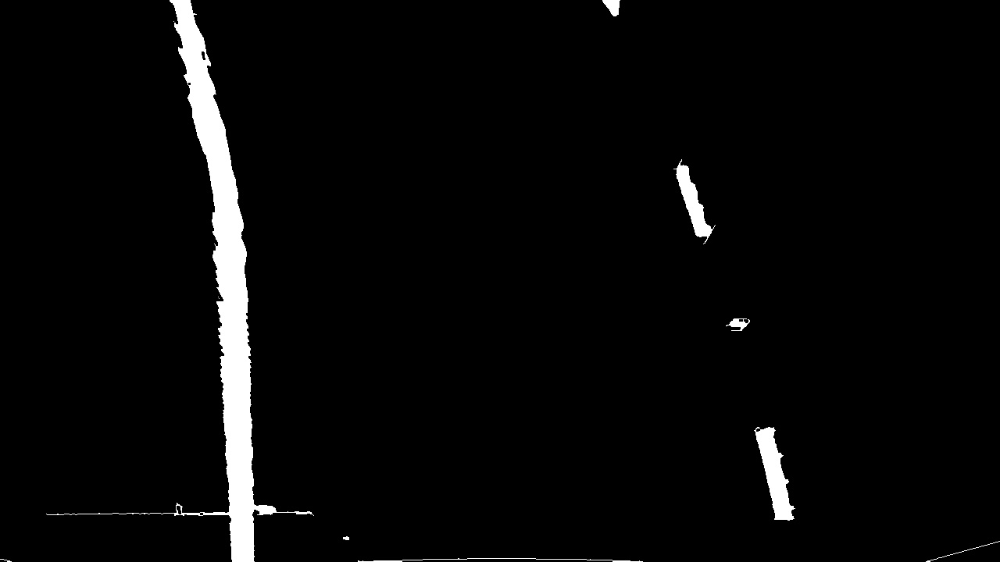
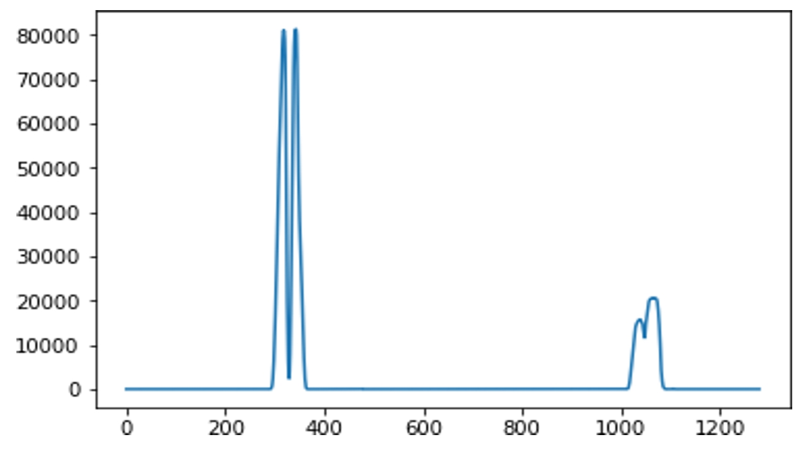
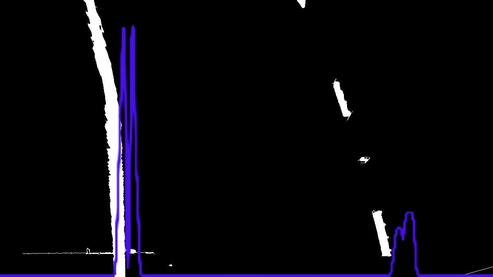
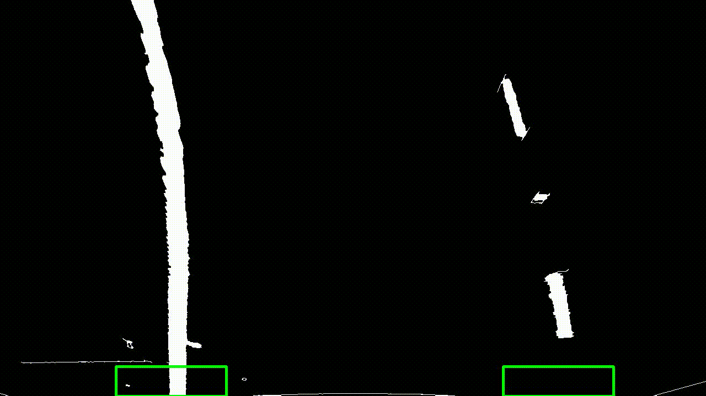
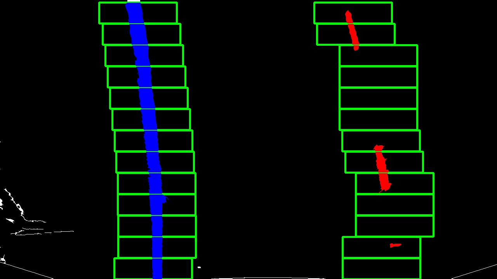
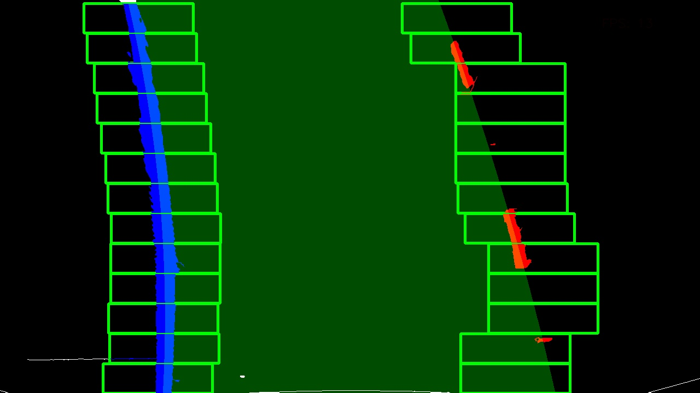

# Lane Keeping Assist

Providing brief gentle inputs to the steering wheel to help avoid drifting out of your lane unintentionally by detecting lane lines and estimating car offset from center then computing radius of curvature using a forward looking camera. It doesn't mean it is continuously steering the vehicle in the center of the lane i.e. the driver should always steer the vehicle manually. The brief inputs from the system only meant to warn and guide the driver back into the lane.
 
    
- ## Project Goal   
    > Developing softwar solution that serves level-1 of autonomy `lateral control` for self driving cars.   
    > The project is for educational purposes that involves applying classical computer vision and machine learning.   
 
</br></br>
<h3 align=center>Project Demo</h3>

<table>
    <tr>
        <td></td>
        <td></td>
    </tr>
</table>
<table>
    <tr>
        <td></td>
        <td></td>
    </tr>
</table>
</br></br>

- ## Project Objectives:
    - [x] Calibrating and undistorting the camera model used to shoot the project dataset
    - [x] Extracting lanes binary mask using color/edge thresholding 
    - [x] Selecting ROI region points of the lane to be tracked
    - [x] Transforming polygon ROI points to rectangular bird view points
    - [x] Applying histogram peaks to estimate initial left/right lane centers
    - [x] Using sliding window to locate/group pixels belong to same lane
    - [x] Fitting polynomial equation that represent the curved lanes
    - [x] Mapping the fitted equation from bird view to roi view
    - [x] Plot polygon filling the region between the left/right lanes
    - [x] Run in realtime for videos: Analyze more than 15 **`FPS`**

</br></br>   

- ## Processes Analysis
    > This section will briefly explain how the algorithim works step by step
    
    1. ### Camera Model Calibration
       - **Pinhole Camera Model**   
       > Transforming 3D-space real world scenes into 2D-space images using homogeneos coordinates,   
       > to do so the focal length, optical center, and radial distortion coefficients of the lens must be know first using a calibration method.   
       
          
           
              
        <table>
            <tr>
                <td></td>
                <td></td>
                <td></td>
            </tr>
        </table>
        </br>   
        
       - **Calibration Methods**   
           - Frist Method: Requires knowing something about the object in the real world 3D-space by satisfying one of:   
                - Vanishing Points   
                - 2D planar known object   
                - 3D object with known shape and size   
           - Second Method: Assumes no known object in 3D-space   
                - Taking multiple views with differnt angles and positions of a specific scene like 8x8 Chessboard    
                - Computing the relative camera rotation and translation by using undo adjustment it tweaks at least 8 2D points for all views
                and compare them in all the views leading to estimate the 3D scene structure.   
          
       
       - **Image Distortion**:    
            - Radial Distortion Bended Edges: Due to camera lens light rays often bend too much, or little at the edges
            - Tangential Distortion Stretched Image: When camera not aligned parallel to objects
            - Both Radial and Tangential Distortions
            
         - Pros   
         ======   
             - Becomes usefull for capturing wide angle fish eye scene   
         - Cons    
         ======   
             - Affects apparent size, and shape of objects   
             
       - **Camera Model Calibration**   
           having all the information (parameters or coefficients) about the camera required to determine an accurate relationship between a 3D point in the real            world and its corresponding 2D projection (pixel) in the image captured by that calibrated camera.   
         
             1. Internal parameters of the camera/lens system. E.g. focal length, optical center, and radial distortion coefficients of the lens.   
             2. External parameters : This refers to the orientation (rotation and translation) of the camera with respect to some world coordinate system.  
           
       - #### **Approach**   
           =======    
           > Using Chessboard images of different size and view angle, then using corner detector to locate corner points of the board
           > that are given as the input and the return is the calibrated camera matrix which will be use to undistort any other image.   
           
        <table>
            <tr>
                <td></td>
            </tr>
        </table>
        </br>   
    
    2. ### Prespective Projection
    > In order to fit a curve that represent the lane lines the lines should appear parallel in the image plane   
    > to achieve prospective projection is applied to warp the prespective view to a bird view that visualizes parallel lines parallel.   
    
    <table style="table-layout: auto;">
        <tr>
            <th align="center">Source Image</th>
            <th align="center">Warped Image</th>
        </tr>
        <tr>
            <td></td>
            <td>
        </tr>
    </table>    
    </br>   
    
    3. ### Binary Masking
    > Blocking out any details in the image except the lane lines by thresholding Saturation, and Blue color channels   
    > then combining the result with edge detector and using that mask to be scanned to extract lane line x, y coordinates.   
    
    <table style="table-layout: auto;">
        <tr>
            <th align="center">Warped Image</th>
            <th align="center">Binary Image</th>
        </tr>
        <tr>
            <td></td>
            <td>
        </tr>
    </table>   
    </br>    
    
    4. ### Histogram Peaks
    > Computing pixels histogram along the x-axis for the bottom half of the image where the lanes should be found    
    > using the maximum peaks of the histogram as the initial location of the center of the lane lines.   
    
    <table style="table-layout: auto;">
        <tr>
            <th align="center">Binary Image</th>
            <th align="center">Histogram Peaks Image</th>
        </tr>
        <tr>
            <td></td>
            <td>
        </tr>
    </table>   
    </br>   
    
    5. ### Sliding Window
    > Sliding a fixed size window starting from the initial centers computed from step-4 that computes the mean of all pixels
    > within the current window position and append the current window location to lane line coordinates only if the mean > given pixel value threshold.   
    
    <table style="table-layout: auto;">
        <tr>
            <th align="center">Binary Image</th>
            <th align="center">Sliding Window Algorithm</th>
        </tr>
        <tr>
            <td></td>
            <td>
        </tr>
    </table>  
    </br>   
    
    6. ### Polynomyal Regression
    > Using 2nd order regression to fit the lane line curve that marks the lane left and right boundries.   
    
    <table style="table-layout: auto;">
        <tr>
            <th align="center">Scaned Image</th>
            <th align="center">Fitted Lane Boundries</th>
        </tr>
        <tr>
            <td></td>
            <td>
        </tr>
    </table>   
    </br>   
    
    7. ### Radius of Curvature
    > Radius of curvature is obtained by the formula:    
    
          
    Y values are in pixels to map the radius from pixels to meters it is multiplied by 
    

    <table style="table-layout: auto;">
        <tr>
            <th align="center">Lane Dimensions in meter</th>
        </tr>
        <tr>
            <td></td>
        </tr>
    </table>   
    </br></br>   
    
- ## Project Setup and Requirements   
    **`use python3.5`** or newer versions to install and run the package  
    ```bash
    $ git clone https://github.com/loaywael/AdvancedLaneDetector.git   
    $ pip3 install -r requirements.txt      
    ```   
    
    alternatively install dependencies in virtualenv `recommended`   
    ```bash
    $ pip3 install virtualenv   
    $ python3 -m virtualenv venv   
    $ pip3 install -r requirements.txt   
    ```   


- ## How to Use   
    `HogModel` is excutable package can be run given command arguments   

    supported arguments:   
    - **`-p --path`**: the image/video to be analyzed (required) argument   
    - **`-s --save`**: saving rendered roject output video (default is False)
    - **`-n --name`**: the output file name and extension (default is output_video.mp4)
    </br>   

    ```bash  
    $ cd ./src     
    $ python -m LaneDetector -p ../data/driving_datasets/project_video.mp4   
    ```    
    
***

- ## System Constraints
  - sensitive to shadows and high luminant environments
  - sensitive to extreme weather conditions    
  
- ## Future Work   
    using Deep learning semantic segmentation to build more robust algorithm that stands out in hard weather conditions
***
    
# REFERENCES

> Thanks for these references I was able to get over problems I've faced during implementation.   
>   
>   PyData Webinar by Ross Kippenbrock   
>    https://www.youtube.com/watch?v=VyLihutdsPk    
>    
>    Udacity open dataset    
>    https://github.com/udacity/CarND-Advanced-Lane-Lines   
>   
>   Lane Keeping Assist    
>    https://www.youtube.com/watch?v=r8G0n5LeJo0    
>    https://topclassactions.com/lawsuit-settlements/consumer-products/auto-news/what-is-lane-keep-assist/    
>
>    Lane Dimensions Standards    
>    http://www.ctp.gov.in/RoadMarkings.htm   
> 
>    Image Formation - Pinhole Camera Model
>    https://www.youtube.com/watch?v=nOQvjG7Jbao   
>
>    Camera Model Calibration
>    https://www.learnopencv.com/camera-calibration-using-opencv/
>    https://www.mathworks.com/help/vision/ug/camera-calibration.html

>
>    Perspective projection
>    https://www.youtube.com/watch?v=17kqhGRDHc8   
    
    


