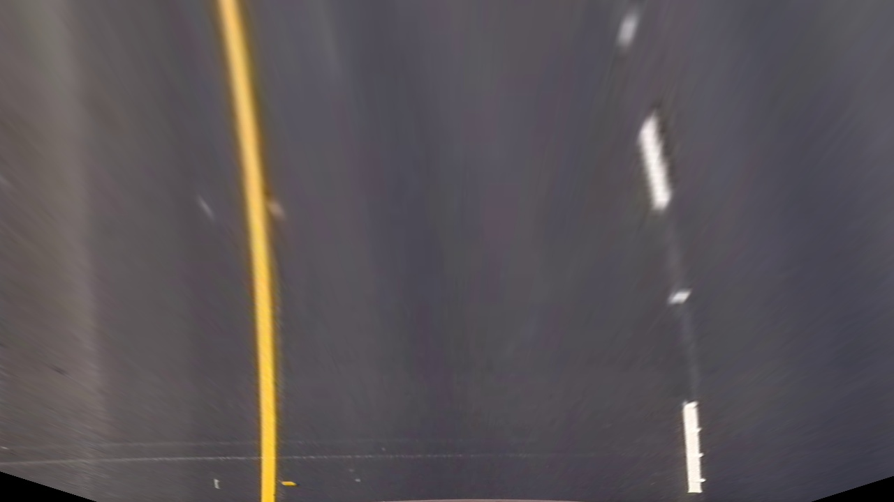
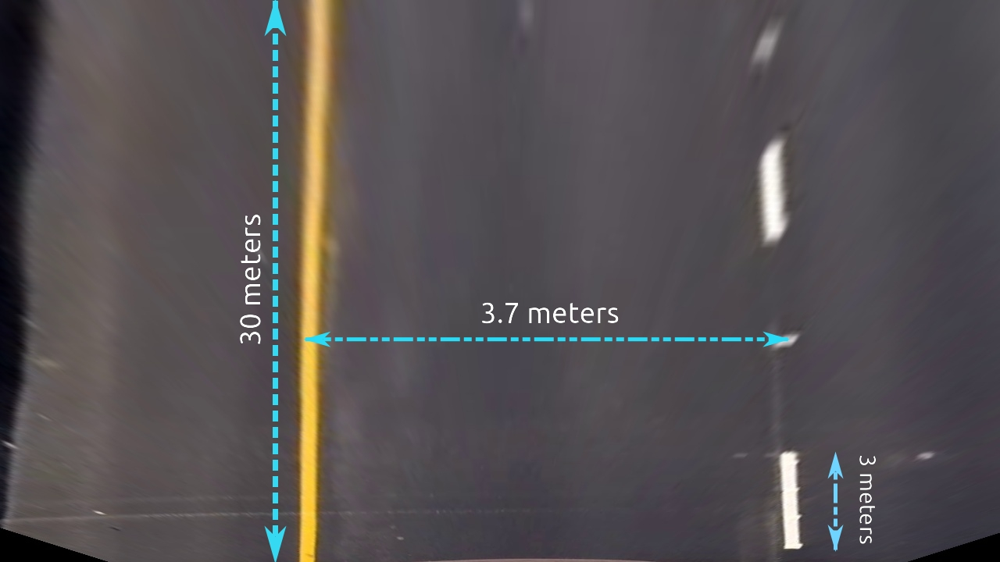

# Lane Keeping Assist

Providing brief gentle inputs to the steering wheel to help avoid drifting out of your lane unintentionally by detecting lane lines and estimating car offset from center then computing radius of curvature using a forward looking camera. It doesn't mean it is continuously steering the vehicle in the center of the lane i.e. the driver should always steer the vehicle manually. The brief inputs from the system only meant to warn and guide the driver back into the lane.
 
    
- ## Project Goal   
    > Developing softwar solution that serves level-1 of autonomy `lateral control` for self driving cars.   
    > The project is for educational purposes that involves applying classical computer vision and machine learning.   
 
</br></br>
<h3 align=center>Project Demo</h3>

<table>
    <tr>
        <td></td>
        <td></td>
    </tr>
</table>
<table>
    <tr>
        <td></td>
        <td></td>
    </tr>
</table>
</br></br>

- ## Project Objectives:
    - [x] Calibrating and undistorting the camera model used to shoot the project dataset
    - [x] Extracting lanes binary mask using color/edge thresholding 
    - [x] Selecting ROI region points of the lane to be tracked
    - [x] Transforming polygon ROI points to rectangular bird view points
    - [x] Applying histogram peaks to estimate initial left/right lane centers
    - [x] Using sliding window to locate/group pixels belong to same lane
    - [x] Fitting polynomial equation that represent the curved lanes
    - [x] Mapping the fitted equation from bird view to roi view
    - [x] Plot polygon filling the region between the left/right lanes
    - [x] Run in realtime for videos: Analyze more than 15 **`FPS`**


- ## Processes Analysis
    This section will briefly explain how the algorithim works step by step
    
    1. ### Undistorting camera model
       **Image Distortion**: 
            - Radial Distortion Bended Edges: Due to camera lenses light rays often bend too much, or little at the edges
            - Tangential Distortion Stretched Image: When camera not aligned parallel to objects
            - Both Radial and Tangential Distortions
            
         Pros
         ====
             - Becomes usefull for capturing wide angle fish eye scene
         Cons
         ====
             - Affects apparent size, and shape of objects
             
         **Camera Model Calibration**
           having all the information (parameters or coefficients) about the camera required to determine an accurate relationship between a 3D point in the real            world and its corresponding 2D projection (pixel) in the image captured by that calibrated camera.   
         
           1. Internal parameters of the camera/lens system. E.g. focal length, optical center, and radial distortion coefficients of the lens.   
           2. External parameters : This refers to the orientation (rotation and translation) of the camera with respect to some world coordinate system.  
           
    <table>
        <tr>
            <td></td>
        </tr>
    </table>
    
    2. ### warping Region of Interest (ROI) to bird view
    <table style="table-layout: auto;">
        <tr>
            <th align="center">Source Image</th>
            <th align="center">Warped Image</th>
        </tr>
        <tr>
            <td></td>
            <td>
        </tr>
    </table>
    
    3. ### extracting lanes binary mask (edge/color) thresholding
    <table style="table-layout: auto;">
        <tr>
            <th align="center">Warped Image</th>
            <th align="center">Binary Image</th>
        </tr>
        <tr>
            <td></td>
            <td>
        </tr>
    </table>
    
    4. ### extracting initial coordinates of the lane center using histogram peaks
    <table style="table-layout: auto;">
        <tr>
            <th align="center">Binary Image</th>
            <th align="center">Histogram Peaks Image</th>
        </tr>
        <tr>
            <td></td>
            <td>
        </tr>
    </table>
    
    5. ### applying sliding window algorithm locating lane points x, y coordinates
    <table style="table-layout: auto;">
        <tr>
            <th align="center">Binary Image</th>
            <th align="center">Sliding Window Algorithm</th>
        </tr>
        <tr>
            <td></td>
            <td>
        </tr>
    </table>
    
    6. ### fitting 2nd-order polynomyal equation of the sliding window x, y coordinates 
    <table style="table-layout: auto;">
        <tr>
            <th align="center">Scaned Image</th>
            <th align="center">Fitted Lane Boundries</th>
        </tr>
        <tr>
            <td></td>
            <td>
        </tr>
    </table>
    
    7. ### calculating radius of curvature
    <table style="table-layout: auto;">
        <tr>
            <th align="center">Lane Dimensions in meter</th>
        </tr>
        <tr>
            <td></td>
        </tr>
    </table>
    
- ## Project Setup and Requirements   
    **`use python3.5`** or newer versions to install and run the package  
    ```bash
    $ git clone https://github.com/loaywael/AdvancedLaneDetector.git   
    $ pip3 install -r requirements.txt      
    ```   
    
    alternatively install dependencies in virtualenv `recommended`   
    ```bash
    $ pip3 install virtualenv   
    $ python3 -m virtualenv venv   
    $ pip3 install -r requirements.txt   
    ```   


- ## How to Use   
    `HogModel` is excutable package can be run given command arguments   

    supported arguments:   
    - **`-p --path`**: the image/video to be analyzed (required) argument   
    - **`-s --save`**: saving rendered roject output video (default is False)
    - **`-n --name`**: the output file name and extension (default is output_video.mp4)
    </br>   

    ```bash  
    $ cd ./src     
    $ python -m LaneDetector -p ../data/driving_datasets/project_video.mp4   
    ```    
    
***

- ## System Constraints
  - sensitive to shadows and high luminant environments
  - sensitive to extreme weather conditions    
  
- ## Future Work   
    using Deep learning semantic segmentation to build more robust algorithm that stands out in hard weather conditions
***
    
# REFERENCES

> Thanks for these references I was able to get over problems I've faced during implementation.   
>   
>   PyData Webinar by Ross Kippenbrock   
>    https://www.youtube.com/watch?v=VyLihutdsPk    
>    
>    Udacity open dataset    
>    https://github.com/udacity/CarND-Advanced-Lane-Lines   
>   
>   Lane Keeping Assist    
>    https://www.youtube.com/watch?v=r8G0n5LeJo0    
>    https://topclassactions.com/lawsuit-settlements/consumer-products/auto-news/what-is-lane-keep-assist/    
>
>    Lane Dimensions Standards    
>    http://www.ctp.gov.in/RoadMarkings.htm   
> 
>    Image Formation - Pinhole Camera Model
>    https://www.youtube.com/watch?v=nOQvjG7Jbao   
>
>    Camera Model Calibration
>    https://www.learnopencv.com/camera-calibration-using-opencv/
>
>    Perspective projection
>    https://www.youtube.com/watch?v=17kqhGRDHc8
    
    


